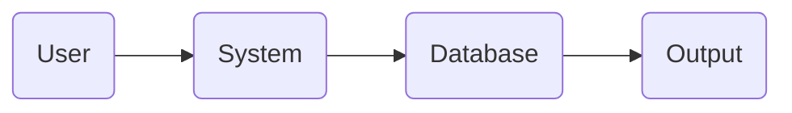

<!-- HEADER -->

<h1 align="center">🐄 GOWALA</h1>

<p align="center">
  <b>Smart • Modern • Interactive System</b><br>
  <i>Built with passion by Safat Ahmed</i>
</p>

<p align="center">
  
</p>

---

<!-- BADGES -->

<p align="center">
  
  
  
  
</p>

---

## 🚀 About The Project

> **GOWALA** is a next-generation smart system designed to simplify management and improve efficiency.
> It combines performance, security, and modern UI to deliver a powerful user experience.

---

## ✨ Features

✔️ Smart Automation
✔️ Secure System
✔️ Real-time Monitoring
✔️ Fast Performance
✔️ Clean UI/UX

---

## 🎬 Live Preview

<p align="center">
  
</p>

---

## 📸 Screenshots

<p align="center">
  
  
  
</p>

---

## 🧠 Tech Stack

<p align="center">
  
</p>

---

## ⚙️ Installation

```bash
# Clone repo
git clone https://github.com/Safat-5958/GOWALA-.git

# Go to folder
cd GOWALA-

# Install dependencies
npm install

# Run project
npm start
```

---

## 🧩 Project Structure

```bash
GOWALA/
├── frontend/
├── backend/
├── images/
├── assets/
└── README.md
```

---

## 📊 Workflow



---

## 🛣️ Roadmap

* 🚧 Add AI features
* 📱 Mobile App Version
* ☁️ Cloud Integration
* 🔔 Notification System

---

## 🤝 Contributing

Contributions are welcome!

```bash
git checkout -b feature-name
git commit -m "Added feature"
git push origin feature-name
```

---

## 👨‍💻 Author

<p align="center">
  
</p>

<p align="center">
  <b>Safat Ahmed</b><br>
  <a href="https://github.com/Safat-5958">GitHub Profile</a>
</p>

---

## 💖 Support

<p align="center">
  ⭐ Star this repo if you like it! <br>
  🍴 Fork it • 📢 Share it • 🚀 Grow it
</p>

---

## 🔥 Fun Section

<p align="center">
  
</p>

<p align="center">
  
</p>

---

## 📜 License

This project is licensed under the MIT License.

---

<p align="center">
  💚 Made with Love in Bangladesh
</p>
