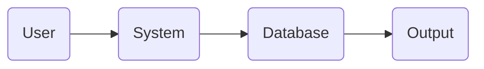

<!-- HEADER -->

<h1 align="center">GOWALA</h1>

<p align="center">
  <b>Smart • Modern • Interactive System</b><br>
  <i></i>
</p>

<p align="center">
  
</p>

---

<!-- BADGES -->

<p align="center">
  
  
  
  
</p>

---

## 🚀 About The Project

> **Gowala is a responsive front-end web application for a food and dairy product delivery service. It allows users to browse products, register/login, place orders, and complete checkout — all from a clean, mobile-friendly interface.


---

## ✨ Features

✔️ Smart Automation
✔️ Secure System
✔️ Attractive Design 
✔️ Clean UI/UX

---

## 🎬 Live Preview

<p align="center">
  
</p>

---

## 📸 Screenshots

<p align="center">
  
  
</p>

---

## 🧠 Tech Stack

<p align="center">
  
</p>

---

## ⚙️ Installation

# Clone repo
git clone https://github.com/Safat-5958/GOWALA-.git

# Run project Using Vs Code
```

---

## 🧩 Project Structure


GOWALA/
├── frontend/
├── images/
├── assets/
└── README.md


---

## 📊 Workflow



---


-


## 🔥 Fun Section

<p align="center">
  
</p>

<p align="center">
  
</p>


